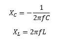
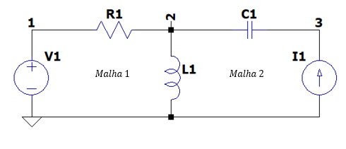

# Calculo de tensão e correntes em circuito alternado Circuitos-II

Trabalho de Circuitos II com múltiplas fontes e múltiplos componentes passivos. Programa feito em 2017 para a disciplina de Circuitos Elétricos II inteiramente por mim (agradecimentos a Luis Felipe Ferreira e Handerson Luiz Saggioro pelo apoio no código e no fluxograma), o intuito era fazer um simulacro de LT SPICE onde por via de linha de código poder ser capaz de imprimir resultados de circuitos em corrente alternada de vários circuitos do tipo RLC.

Ao dar Run no arquivo é pedido para que você informe a frequência no circuito, para que ele calcule as reatâncias capacitivas e indutivas no circuito e que da física sabemos que vale:

  

E aqui vai uma pequena aula de circuitos e malhas e para isso nós temos a seguinte representação esquemática para ajudar:

  

 Onde o ponto do terra (ponto comum) é sempre reconhecido como nó 0. Outros nós como a interseção entre a fonte de tensão e o resistor estarão no nó 1, e por esse raciocínio vamos montando nosso circuito. Vendo que o indutor L1 se situa entre as malhas.
