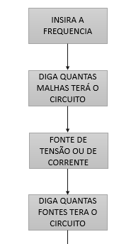
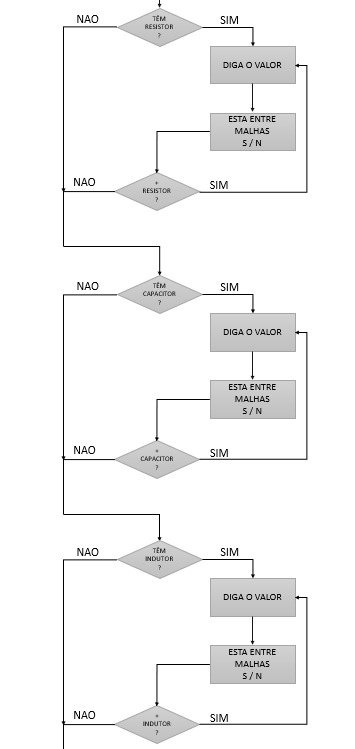
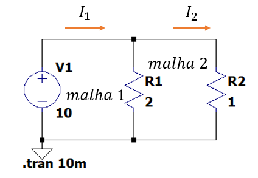
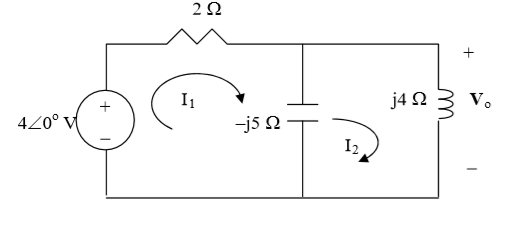

# fonte eletrica alternada

Trabalho feito na faculdade para a disciplina de Circuitos Elétricos II com múltiplas fontes e múltiplos componentes passivos.

Programa feito em 2017 feito inteiramente por mim (agradecimentos a Luis Felipe Ferreira e Handerson Luiz Saggioro pelo apoio no código e no fluxograma), o intuito era fazer um simulacro estilo LT SPICE onde por via de linha de código (com script feito na linguagem Octave) eu possa ser capaz de imprimir resultados de corrente elétrica e tensão elétrica de circuitos em corrente alternada do tipo RLC. Foi utilizado nesse programa a análisa por malhas.

***Obs*** Esse programa eu fiz em 2017 e muito das boas práticas de programação eu não sabia na época e também não sabia como implementar no Octave mas foi um dos primeiros programas que me fizeram gostar do mundo da programação e a estudar mais sobre o assunto depois da formação. Tanto que é por isso que não vou fazer a documentação desse programa em inglês, pois é só para fins demonstrativos e não para colocar em mercado (para isso eu precisaria retrabalhar o código de fato).

## Usando o programa

Ao dar Run no arquivo é pedido para que você informe a frequência do circuito todo, para que ele calcule as reatâncias capacitivas e indutivas no circuito.



Informaremos a frequência que o circuito tem, quantas malhas teremos, e se temos fontes de tensão ou de corrente e você pode colocar quantos componentes quiser no circuito.

Após essa parte vem a parte procedural, e você irá colocar o número de resistores, capacitores e indutores no circuito, tudo por linha de código.



Aqui vamos colocando os resistores, os capacitores e os indutores da forma como desejamos dentro do circuito e quantos nós queremos posicionado ele nas malhas ou em uma posição entre as malhas

Após isso é mostrado os resultados das correntes e tensões nas malhas, para exemplificar um circuito simples como o de baixo



Para montar esse circuito de corrente direta bastaria seguir o seguinte fluxo de código no script, notando que malha 1 é o circuito a esquerda e malha 2 a direita

```octave
Informe a frequencia [Hz]
0
Quantas malhas tera o circuito?
2
---------------------------------------
Serao selecionados agora as fontes
---------------------------------------
Fonte de corrente ou de tensao? c ou t
 Aperte s pra sair da selecao
t
Insira o modulo da tensao
10
Insira o angulo de fase [em graus]
0
Componente esta entre duas malhas? S ou N
n
Informe a malha1
Deseja mais fontes de tensao? Digite t 
 Aperte s pra sair da selecao
s
---------------------------------------
Serao selecionados agora os resistores
---------------------------------------
Tera resistores? S ou N
s
Qual o valor?
2
Componente esta entre duas malhas? S ou N
s
Informe a primeira malha
 1
Informe a segunda malha
2
Tera mais resistores? S ou N
s
Qual o valor?
1
Componente esta entre duas malhas? S ou N
n
Informe a malha
2
Tera mais resistores? S ou N
n
---------------------------------------
Serao selecionados agora os capacitores
---------------------------------------
Tera capacitores? S ou N
n
nao serao colocados mais capacitores 
---------------------------------------
Serao selecionados agora os indutores
---------------------------------------
Tera indutores? S ou N
n
nao serao colocados mais indutores
```

Isso nos dará como resultados

```octave
Voce selecionou 2 resistores,0 capacitores e 0 indutores


  R(1)=2.00 ohms |  R(2)=1.00 ohms |


-------------------------------------
Resultado tensoes e das correntes nas malhas

 V(1)=10.000 + 0.000i V |
-------------------------------------

I(1)=15.0000000 A < 0.0000000 A
I(2)=10.0000000 A < 0.0000000 A
```

Os resultados imprimem mais do que o que seria necessário mas aqui ele serve para dizer toda a biblioteca de componentes que pegamos, e os resultados que estão acurados, note que I(1) seria a corrente total e não a corrente entre as malhas.

## Um pouco sobre circuitos alternados

E aqui vai uma pequena aula de circuitos e malhas e para isso nós temos a seguinte representação esquemática para ajudar:

 

 Onde o ponto do terra (ponto comum) é sempre reconhecido como nó 0. Outros nós como a interseção entre a fonte de tensão e o resistor estarão no nó 1, e por esse raciocínio vamos montando nosso circuito. Vendo que o indutor L1 se situa entre as malhas.

 As reatâncias dos componentes não resistivos (no caso o indutor e o capacitor são calculados por)

  

  Onde `w=2πf` e é gerado um vetor de todos as resistências, das reatâncias capacitivas e reatâncias indutivas selecionadas e tudo em sua forma complexa.

## Testando em um circuito real

Pelo livro do sadiku (5 edição em português, capítulo 10, exercício 24) vemos o seguinte circuito possível



Valores esses dados pelo solucionário

Seus resultados (pelo solucionário) são I1=0.2I2 para I2=1/(0.1+j) o que é 0.995<-84.29, vamos montar ele no octave, sabendo que para uma frequência de 1 Hz, a capacitância deve ser de 0.03183 F e a indutância de 0.6366 H para que as reatâncias sejam a que foram mostradas na imagem.

Com isso o fluxo do código será:

```octave
Informe a frequencia [Hz]
1
Quantas malhas tera o circuito?
2
---------------------------------------
Serao selecionados agora as fontes
---------------------------------------
Fonte de corrente ou de tensao? c ou t
 Aperte s pra sair da selecao
t
Insira o modulo da tensao
4
Insira o angulo de fase [em graus]
0
Componente esta entre duas malhas? S ou N
n
Informe a malha1
Deseja mais fontes de tensao? Digite t 
 Aperte s pra sair da selecao
s
---------------------------------------
Serao selecionados agora os resistores
---------------------------------------
Tera resistores? S ou N
s
Qual o valor?
2
Componente esta entre duas malhas? S ou N
n
Informe a malha
1
Tera mais resistores? S ou N
n
---------------------------------------
Serao selecionados agora os capacitores
---------------------------------------
Tera capacitores? S ou N
s
Qual o valor?
0.03183
Componente esta entre duas malhas? S ou N 
s
Informe a primeira malha
 1
Informe a segunda malha
 2
Tera mais capacitores? S ou N
n
---------------------------------------
Serao selecionados agora os indutores
---------------------------------------
Tera indutores? S ou N
s
Qual o valor?
0.6366
Componente esta entre duas malhas? S ou Nn
Informe a malha
2
Tera mais indutores? S ou N
n
```

Resultados:

```octave
Voce selecionou 1 resistores,1 capacitores e 1 indutores


  R(1)=2.00 ohms |
 C(1)=0.03183000 F |
 L(1)=0.64 H |
-------------------------------------
Resultado tensoes e das correntes nas malhas

 V(1)=4.000 + 0.000i V |
-------------------------------------

I(1)=0.1990625 A < -84.2878211 A
I(2)=0.9950653 A < -84.2878211 A
```

O que era esperado.

## TODO caso eu pegue nesse código de novo

- Refatorar o código

- Tratar excessões

- Voltar para caso eu tenho feito algum erro na hora de montar o circuito

- caso só tenha duas malhas e o componente está entre essas duas não precisar perguntar quais as malhas pois está subentendido quais são

- uma possível interface gráfica (maior motivação para voltar a trabalhar nesse código um dia)
